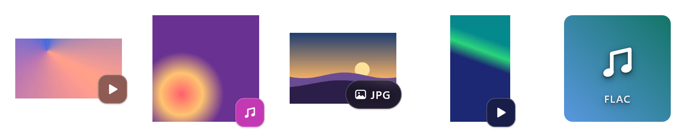

<div align="center">


# skyggn

**video, music, photo and camera raw thumbnails for windows file explorer.**<br>
an open-source alternative to icaros: mkv, webm, flac, heic, raw photos, comics and 170 more file
types get real thumbnails and details in windows 10 and 11.

[](../../releases/latest)

[purr.github.io/skyggn](https://purr.github.io/skyggn/)




</div>

## why

windows only makes thumbnails for formats it has codecs for, so mkv and webm videos, flac songs,
heic photos, camera raws, comics and many more show up in file explorer as plain icons, and
explorer knows next to nothing about an mkv or an flv beyond its length. skyggn adds one thumbnail
handler built on ffmpeg, libraw, libarchive and windows' own image codecs, so they all show real
pictures: in file explorer, in open and save dialogs, and in every app that asks windows for
thumbnails. for the formats windows describes poorly, it fills in explorer's details too.

|  |  |
|---|---|
| 🎬 **video** | a frame from the point you choose, black intros skipped, or the cover a video carries. hdr is tone-mapped, phone videos stand upright. |
| 🎵 **audio** | the album cover from mp3, flac, ogg, opus, m4a, mka, wma, ape and more. |
| 🖼️ **images** | heic (also the tiled ones phones make), avif, jpeg xl, webp, psd, exr, svg, dds, tga and the usual jpeg, png, gif and tiff. |
| 📷 **camera raw** | canon, nikon, sony, fujifilm, panasonic, olympus, pentax, leica, sigma, hasselblad, phase one and more. |
| 📚 **comics and e-books** | a comic's first page (cbz, cbr, cb7, cbt), an e-book's cover (epub). |
| 📄 **documents** | a pdf's first page, drawn by windows' own pdf renderer, and the preview libreoffice and openoffice save in odt, ods, odp and odg files. |
| ✏️ **design files** | the preview illustrator (ai), eps and indesign (indd) files carry: illustrator's picture of the artwork, an eps file's preview, an indesign layout's first page. |
| 📋 **details** | length, frame size, frame rate, bit rates, codecs, audio and subtitle tracks with their languages, chapters, artist, album and more in explorer, for flv, ape, wavpack, rmvb, divx and over 30 other formats windows leaves blank. |
| 🏷️ **badges** | a small mark tells video, music and photos apart at a glance. three styles, any corner, any size, or none. |
| 🎨 **no picture?** | a song without a cover or a damaged file gets a tile with a big symbol, in a colour made from its contents, so copies match whatever their names; a whole album shares one. |
| 🩹 **damaged files** | a file proven cut off, empty or corrupted says so: under the file type on its tile, or with a small warning mark on its badge when a picture still came out. only what the file's own structure proves counts, so healthy files are never flagged. |
| 🪶 **light** | no background process, no tray icon, no service. windows runs skyggn only while it makes a thumbnail or reads a file's details. |
| ↩️ **clean exit** | every file type gets its previous thumbnails back when you turn it off or uninstall. |

## speed

time per thumbnail, measured the way explorer asks for them (through windows' thumbnail helper
process), on test files made with ffmpeg, with gentle mode on, while the pc ran other work at 65 to
85 % cpu load. the size is 1280 px: on the test pc, that is what windows asked for when it filled
its cache for a large icons view, and it makes the smaller sizes from it. median and fastest of 8
runs:

| file | median | fastest |
|---|---|---|
| full-hd video, mkv (h.264) | 150 ms | 143 ms |
| full-hd video, mp4 (h.264) | 164 ms | 133 ms |
| 4k video, mkv (hevc) | 267 ms | 208 ms |
| 4k hdr video, mkv (hevc 10-bit) | 296 ms | 247 ms |
| 12-megapixel photo, jpeg | 242 ms | 166 ms |
| song with cover art, mp3 | 172 ms | 135 ms |
| song without cover art, mp3 (tile) | 157 ms | 135 ms |

windows makes thumbnails as file explorer asks for them, for every thumbnail program alike, and
keeps them: each file costs this once. for a big folder, **make thumbnails now** in the app (or
`skyggnctl prepare`) makes them ahead of time, three at a time, so the folder shows them at once.
online-only cloud files are left alone, so nothing is downloaded.

## install

1. download `skyggn-<version>-x64-setup.exe` from the [latest release](../../releases/latest).
2. run it. windows smartscreen asks first, because the setup is not code-signed: click **more
   info**, then **run anyway**.
3. allow the admin prompt once. the setup turns skyggn on for the recommended file types, for
   every user of the pc. installing a newer version over it keeps the file types you chose.
4. open a folder with videos or music. thumbnails windows already had keep their old look until
   you click **refresh thumbnails** in the skyggn app.

to remove it: settings > apps > installed apps > skyggn > uninstall.

## questions

**mkv or webm thumbnails are not showing in windows 11 file explorer.** windows has no codec for
them. install skyggn and they get a frame from the video, or the cover the file carries.

**flac, ogg or mka cover art does not show in explorer.** skyggn shows the album cover embedded in
the file, for mp3, flac, ogg, opus, m4a, mka, wma, ape and more; a song without one gets a tile.

**heic, avif or camera raw photos show only icons.** skyggn shows them without extra codecs from the
microsoft store: heic and avif through ffmpeg, raws (cr2, cr3, nef, arw, raf, dng…) from the
preview the camera embedded.

**is it an alternative to icaros?** yes. icaros is free but closed source; skyggn is open source
(gpl-3.0), with a settings app in windows 11's own style, and it gives every file type its
previous thumbnails back when it is turned off or uninstalled.

**will it slow down my pc or games?** no service and no background process: windows runs skyggn
only while it makes a thumbnail. gentle mode (on by default) makes each one on a single processor
core, so games and other programs keep all the others.

**thumbnails or file icons still have the old look after a change or an update.** windows keeps
the thumbnails and icons it made. click **refresh thumbnails** in the skyggn app; file explorer
closes for a moment and makes them again as you browse.

## more

<details>
<summary><b>the app</b></summary>

skyggn's settings app is built with winui 3, like windows 11's own apps: mica, settings cards,
light and dark mode. it runs only while it is open, in english or german: windows' language by
default, or the one chosen on its general page. the installer follows windows' language too.

- **general**: turn skyggn on or off, refresh thumbnails, make a folder's thumbnails ahead of time
  (paste or pick a folder, with or without its subfolders, and follow it on a progress bar), show
  or hide the app icon windows puts on thumbnails, fix broken entries left behind by removed
  thumbnail programs, and pick the app's language.
- **thumbnails**: the badge (style, corner, size), files without a picture, where in a video the
  frame is taken, blank frames, cover art, gentle mode and the time limit. a live preview shows a
  sample video and a sample song without a cover, and any file you pick. after a change, a bar
  offers to refresh the thumbnails windows already has, so explorer shows the new look.
- **file types**: all 179, in six groups, each on or off.
- **about**: version, credits and licences.

changes for every user of the pc ask for admin rights once (the uac shield marks them). changes
for your own account never ask.

</details>

<details>
<summary><b>badges and placeholders</b></summary>

the badge sits on a corner of the picture, mostly on it and hanging out past its corner, with a
soft shadow. the picture keeps its shape and stays centred, with a little transparent room around
it for the part that hangs out and the shadow, so every thumbnail in a folder lines up. for the file types skyggn handles,
windows' own decorations (the film strip around videos, the border around photos) are switched
off, since they would land in that room; uninstalling puts them back.

| setting | choices |
|---|---|
| style | frosted glass (default), coloured by kind, with the file type (`MKV`, `MP3`…), none |
| corner | bottom right (default), bottom left, top right, top left |
| size | 16 to 32 % of the thumbnail (24 by default), the same on every file |

thumbnails smaller than 48 px get no badge; the file type shows from 128 px up. pictures named the
way windows picks an app's icons (`name.targetsize-256.png`, `name.scale-200.png`) get no badge
and no tile: windows draws the icons of the file types an app opens from them.

a file without a picture gets a tile with its kind's symbol and its file type. its colours come
from the album for songs, so an album matches, and from all of the file's contents for everything
else (a sha-256 of the whole file): copies get the very same tile whatever their names, which makes
duplicates easy to spot, and any other file gets another. tiles differ in two hues, lightness,
colourfulness and which of eight ways the gradient runs, so different files rarely look alike. a
file over 64 MB, or one not read within the time limit, gets its kind's colour instead, since its
contents were not compared. for one calm colour per kind, pick "tile in the kind's colour"; the tile can
also be turned off for windows' usual icon.

</details>

<details>
<summary><b>damaged files</b></summary>

skyggn tells a damaged file from one it merely cannot read. it only calls a file damaged when the
file's own structure proves it, never because reading failed: an unknown codec, copy protection, a
password or the time limit fail just the same. the format is told by the file's first bytes, not
its name.

| says | when |
|---|---|
| empty | the file has no bytes, or nothing but zero bytes (space a download set aside but never filled) |
| incomplete | it ends before its own structure says it does, or lacks a part every finished file has: an mp4, mov, heic or avif without its index (`moov`, `meta`) or whose index places media past the end, an mkv or webm whose index (seek head) places parts past the end, a zip (cbz, epub, odt…) without its table of contents, a 7z, png, flac or id3 tag cut short, a pdf without its end marker |
| corrupted | a checksum over its header fails (png, 7z), or it points past its own end (pdf) |

a size field alone never counts: a writer can get one wrong in a complete file. when a file runs
past its end by its sizes, its own index has to place media out there too.

a damaged file gets a small amber warning mark: on its badge's corner when a picture still came
out (half a download often gives one), or on the corner of its tile, where the word also shows
under the file type (from a 120 px tile up, in windows' display language). with badges off there
is no mark.

wav and avi are not judged, since files written through a pipe keep placeholder sizes, nor jpeg,
since phones put a video after its end, nor mp3 without a tag, ogg, or damage inside a file, which
only decoding all of it would prove. `skyggnctl check <file>` says what skyggn proves about a file.

</details>

<details>
<summary><b>details in explorer</b></summary>

for up to 41 formats skyggn also gives explorer a file's details: the details pane, the details tab of
its properties, and the columns of the details view (length, frame width, bit rate...).

| kind | what | formats |
|---|---|---|
| video | length, frame width and height, frame rate, video and total bit rate, codec, video, audio and subtitle tracks, chapters, title, year, director | mkv, mk3d, webm, flv, f4v, rm, rmvb, divx, xvid, mxf, nut, qt, ivf, bik, amv, dv, evo, m2p, mpv, mjpeg, trp, vro |
| audio | length, channels, sample rate, bit rate, sample size (lossless), codec, title, artist, album, album artist, track, year, genre, composer | mka, weba, ape, wv, tak, tta, mpc, spx, aiff, aifc, aif, caf, au, amr, dts, dsf, dff, m4r |

four of these are skyggn's own, since windows has no columns for them: **video tracks**
(`H264 1920×1080`), **audio tracks** (`AC3 5.1 [ger] Commentary`), **subtitles** (`SRT [eng]; PGS
[ger] forced`) and **chapters** (how many). skyggn describes them to windows in a property schema,
with their names in english and german, and adds them to the details tab of the video formats
above.

these are the formats windows has no details for. matroska (mkv, mka, webm, weba) is listed too,
but on most pcs windows keeps its details to itself: it has a list of system types (mp4, mp3,
matroska and others, 56 in all) whose details only its own handlers give, and that list belongs to
windows, not to the administrator. skyggn reads the list on the pc and leaves those types alone,
so by default mkv keeps windows' details there (just the length), and the track columns do not
reach it. where windows has no matroska handler, as on a windows n edition without its media
feature pack, skyggn's gives mkv its details anyway.

to have skyggn's details for mkv and webm everywhere, turn on **details for mkv and webm** on the
app's general page (or `skyggnctl system-details on`). it sets windows' entries for those types
aside, with the restore privilege backup programs use: the list keeps its owner and permissions,
and turning the option off, or uninstalling, puts windows' entries back exactly. a windows update
may put them back on its own; the app then shows the option as off. for mp4, mov, avi, mp3, flac and the other
formats windows describes well, its own details stay. windows reads details handlers for every user of the pc only, so they come with
the installer, not with an install for one account (`--user`).

explorer loads details handlers into its own process. skyggn's does no reading there: it hands
the file to a separate helper process (`dllhost.exe`), takes the answer and lets the helper go, so
a damaged file cannot crash or hang explorer, and ffmpeg never loads into it.

</details>

<details>
<summary><b>how it stays light</b></summary>

- **no background process.** windows asks for a thumbnail only when its cache has none or the file
  changed, and runs skyggn in a separate helper process (`dllhost.exe`) that exits a few seconds
  after the last one. a broken file cannot crash explorer.
- **one picture per file, at thumbnail size.** the cover art if the file has one, otherwise one
  keyframe, decoded on its own and handed out at once, then scaled straight down. a file whose
  headers say what is in it (an mkv or mp4 video) is not probed first. heic photos use their built-in preview
  when it is big enough, jpegs decode at a reduced size where possible, and camera raws use the
  preview the camera embedded. only a raw with no preview, or one too small, is developed from
  its sensor data, at half size.
- **gentle mode** (on by default) makes each thumbnail on one thread, so games and other programs
  keep the other cores while a folder of videos gets its thumbnails. it keeps normal priority: a
  lowered one made thumbnails wait seconds behind any busy program, such as a compile.
- **a time limit per file** (5 seconds by default). past it, the file gets the no-picture tile;
  nothing can hang.

the measured times are in [speed](#speed) above.

</details>

<details>
<summary><b>file types</b></summary>

179 types in six kinds; the app's file types page and `skyggnctl status` list every one.

| kind | count | for example |
|---|---|---|
| video | 46 | mkv, mp4, webm, avi, mov, wmv, flv, m2ts, mpg, vob, ogv, 3gp |
| audio | 32 | mp3, flac, m4a, ogg, opus, wma, wav, ape, wv, aiff, dsf |
| image | 47 | heic, avif, jxl, webp, jpg, png, gif, tiff, psd, exr, svg, dds, ai, eps |
| camera raw | 38 | cr2, cr3, nef, arw, raf, rw2, orf, dng, pef, x3f, 3fr, iiq |
| comics and e-books | 5 | cbz, cbr, cb7, cbt, epub |
| documents | 11 | pdf, odt, ods, odp, odg, indd and their templates (ott, ots, otp, otg, indt) |

a comic's cover is its first picture in the order explorer sorts names ("page 2" before "page
10"), whatever container it really is: plenty of `.cbr` files are zips. an e-book's cover is the
picture its package marks as the cover.

design files show the preview they carry, the way adobe's programs saved it: illustrator files
(ai, ait) their picture of the artwork, up to 256 px; eps files their tiff preview or illustrator's
picture, the one in colour first (tiff previews are often black and white), then the larger;
indesign layouts (indd, indt) their first page. which one an .ai file
holds is told by its contents, since older ones are eps files inside. an illustrator file without
one gets its page drawn, if it has pdf content; files saved without pdf content only show a note
there, so their preview comes first. an eps file with no preview gets the usual tile: drawing
postscript would take a postscript interpreter.

three are off by default: `.ts` and `.mts` (also typescript source files) and `.raw` (used by many
programs for files that are not photos). when skyggn takes over a file type it remembers the
handler the type had, and puts it back when the type is turned off, unless that handler's program
is gone.

</details>

<details>
<summary><b>skyggnctl</b></summary>

a command line tool for everything the app does, also used by the installer.

| command | what it does |
|---|---|
| `install [--user]` | registers skyggn and turns on the recommended file types; over an existing install, keeps the file types that are on |
| `uninstall [--user]` | gives every file type back and unregisters skyggn |
| `enable <.ext>... [--user]` | turns file types on |
| `disable <.ext>... [--user]` | turns file types off |
| `types <+.ext\|-.ext>... [--user]` | turns file types on (`+`) and off (`-`) in one go |
| `status` | shows which thumbnail handler windows uses for each supported file type |
| `repair [--user]` | removes thumbnail entries whose program is gone (one whose folder was deleted without uninstalling it) |
| `refresh <folder> [--recursive]` | remakes the thumbnails windows keeps for a folder's files, without restarting explorer |
| `prepare <folder> [--recursive]` | makes the thumbnails windows does not have yet for a folder's files, so explorer shows them at once |
| `settings` | shows your settings, each with a plain-words description |
| `set <name> <value>` | changes one of your settings |
| `thumb <file> <out.png> [--size n]` | makes a thumbnail with the engine directly |
| `check <file>` | says whether the file's own structure proves it empty, incomplete (cut off) or corrupted, as its thumbnail shows |
| `shell-thumb <file> <out.png> [--size n]` | asks windows for a fresh thumbnail, the way explorer does |
| `system-details [on\|off]` | reads mkv and webm details too, which windows keeps for its own handler; without on or off, says whether it does |
| `details <file> [--isolated\|--shell]` | shows a file's details: read by the engine, `--isolated` through skyggn's handler in its helper process as explorer runs it, `--shell` from whatever handler windows uses |

without `--user`, changes apply to every user of the pc and need an elevated prompt.

#### settings

per user; each applies to the next thumbnail made.

| name | default | range | meaning |
|---|---|---|---|
| `FramePosition` | 20 | 0-95 | where in the video the frame is taken, in percent |
| `PreferCoverArt` | 1 | 0-1 | use a video's own cover over a frame |
| `SkipBlackFrames` | 1 | 0-1 | look later when the frame is black, white or flat |
| `LowImpact` | 1 | 0-1 | gentle mode: one thread per thumbnail |
| `TimeLimitMs` | 5000 | 500-30000 | time allowed per file, in milliseconds |
| `BadgeStyle` | 1 | 0-3 | 0 none, 1 frosted, 2 coloured by kind, 3 with the file type |
| `BadgeCorner` | 0 | 0-3 | 0 bottom right, 1 bottom left, 2 top right, 3 top left |
| `BadgeSize` | 24 | 16-32 | the badge's height, in percent of the thumbnail |
| `Placeholder` | 2 | 0-2 | a file without a picture: 0 windows' usual icon, 1 a tile in its kind's colour, 2 a tile in a colour from its contents (copies and an album's songs match) |
| `Language` | 0 | 0-2 | the settings app's language: 0 windows', 1 english, 2 german |

</details>

<details>
<summary><b>build from source</b></summary>

needs visual studio 2026 build tools with the c++ desktop workload (which includes cmake) and the
.net 10 sdk. from a "developer powershell for vs 2026" in the repository:

```
cmake --preset x64
cmake --build --preset release
```

everything lands in `build\bin\Release`, laid out as it is installed: `skyggn.exe`,
`skyggnctl.exe`, `skyggn-engine.dll`, ffmpeg's dlls and `licenses\`. configuring downloads ffmpeg
(lgpl build), libraw, libarchive, zlib, xz and wil and checks each against a pinned sha-256 hash;
the app's packages come from nuget.org. the first build compiles libarchive, zlib and xz in both
configurations, which takes several minutes; later builds reuse them.

| task | command |
|---|---|
| try it without installing, for your account only | `build\bin\Release\skyggnctl.exe install --user` |
| undo that | `build\bin\Release\skyggnctl.exe uninstall --user` |
| build the installer (inno setup 6.7: `winget install JRSoftware.InnoSetup`) | `cmake --build --preset release --target installer` |
| redraw the app icon from `assets/skyggn.svg` | `scripts\make-icon.ps1` |
| redraw the thumbnails at the top of this page | `scripts\make-showcase.ps1` |

the installer lands in `build\dist\skyggn-<version>-x64-setup.exe`.

#### releases

github actions builds every push. to publish a release, set the version in
`CMakeLists.txt`, add its section to [CHANGELOG.md](CHANGELOG.md), commit, and push a tag:

```
git tag v0.1.0
git push origin v0.1.0
```

the workflow checks that the tag matches the version, builds the installer, and publishes it with
its sha-256 checksum and that version's changelog as the release text.

</details>

<details>
<summary><b>layout</b></summary>

| path | what |
|---|---|
| `engine/` | `skyggn-engine.dll`: the com thumbnail provider, the decoders, the badges and the registration logic, with a c api for the other parts |
| `engine/assets/` | the badge symbols, as svg; built into the dll |
| `ctl/` | `skyggnctl.exe`, the command line tool |
| `app/` | `skyggn.exe`, the settings app (c#, winui 3, native aot) |
| `installer/` | the inno setup script and its cmake target |
| `assets/` | the app icon (`skyggn.svg`) and the picture at the top of this page |
| `cmake/` | pinned third-party downloads |
| `scripts/` | redraw the icon and the showcase picture |
| `.github/workflows/` | the build and release workflow |
| `docs/` | the page at [purr.github.io/skyggn](https://purr.github.io/skyggn/), served by github pages from this folder |

</details>

## credits

- [ffmpegthumbnails](https://github.com/megakraken/FFmpegThumbnails) by megakraken showed how to
  feed windows' file stream into ffmpeg for explorer thumbnails. skyggn's engine is a new
  implementation of that idea.
- [icaros](https://github.com/Xanashi/Icaros) by xanashi has given explorer ffmpeg thumbnails for
  years, as freeware. skyggn set out to be an open-source alternative to it.
- microsoft's [recipe thumbnail provider sample](https://github.com/microsoft/Windows-classic-samples/tree/main/Samples/Win7Samples/winui/shell/appshellintegration/RecipeThumbnailProvider)
  is the pattern every com thumbnail provider, this one included, builds on.
- [ffmpeg](https://ffmpeg.org) decodes video, audio and images, [libraw](https://www.libraw.org)
  reads camera raws, [libarchive](https://www.libarchive.org) with [zlib](https://zlib.net) and
  [xz](https://tukaani.org/xz/) opens comics and e-books, [wil](https://github.com/microsoft/wil)
  keeps the windows code short, and the
  [windows community toolkit](https://github.com/CommunityToolkit/Windows) gives the app its
  settings cards.

## license

gpl-3.0-or-later, see [LICENSE](LICENSE). third-party licences are in
[THIRD-PARTY-NOTICES.md](THIRD-PARTY-NOTICES.md).
